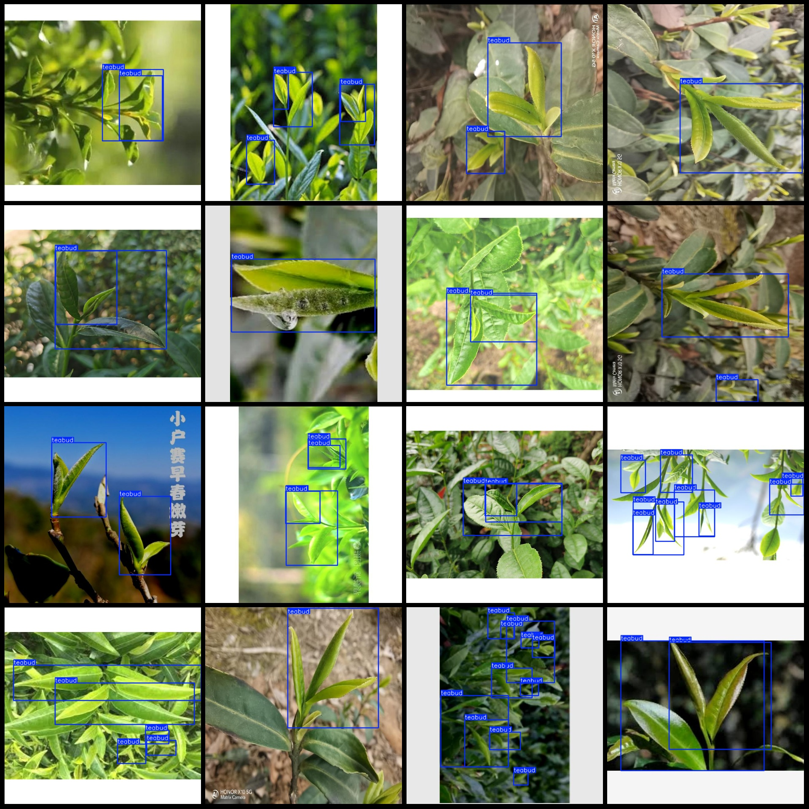

# Intelligent Agriculture Tea Bud Detection Dataset VOC+YOLO Format with 3288 Images in 1 Category Enhanced

**Note:** About one-fourth of the images in the dataset are original, while the remaining are enhanced. Please review the images.

**Dataset Format:** Pascal VOC format + YOLO format (excluding the split path in the txt file, only containing jpg images, corresponding VOC format xml files, and yolo format txt files)

**Number of Images (jpg File Count):** 3228
**Number of Annotations (xml File Count):** 3228
**Number of Annotations (txt File Count):** 3228
**Number of Annotation Categories:** 1
**Annotation Category Name:** "teabud"
**Number of Boxes per Category:**
- teabud boxes = 10102
**Total Boxes:** 10102
**Number of Images per Category:**
- teabud images = 3228
**Image Resolution:** 640x640
**Annotation Tool:** labelImg
**Annotation Rules:** Drawing bounding box boxes for categories
**Important Notice:** The dataset does not have been divided into training, validation, or test sets; please divide them yourself.
**Special Remark:** This dataset does not guarantee the accuracy of the trained model or weight files.
**Image Preview:**
**Annotation Example:**

## Images

Here is a pay link on Stripe ( https://buy.stripe.com/3cs8yP7sY87d0vu9AB ). Please contact me lonlonago@foxmail.com after funding $89, and I will send you a complete data files , thank you!

